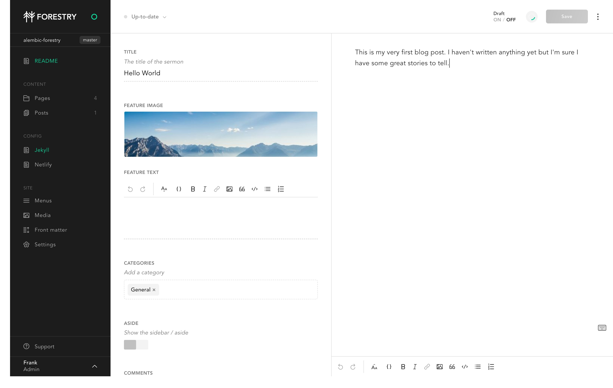

<p align="center">
  <h3 align="center">Alembic x Forestry</h3>
  <p align="center">A starter-kit by David Darnes<p>
</p>

<div align="center">

A simple starting point to use [Alembic Jekyll theme](https://alembic.darn.es/) with [Forestry](https://forestry.io).

</div>

## Development

```bash
# clone the repository
git clone https://github.com/DirtyF/alembic-forestry.git

# go in the project directory
cd alembic-forestry

# install dependencies
bundle install

# Start local dev server
bundle exec jekyll server
```

## Forestry (Content Management)

[](https://app.forestry.io/quick-start?repo=daviddarnes/alembic-forestry-kit&engine=jekyll)

This project has been pre-configured to work with [Forestry](https://forestry.io), just import your repository ✨   
Any changes you make will be commited back to the repo, and deployed if you're using Netlify.



## Deployment

[](https://app.netlify.com/start/deploy?repository=https://github.com/DirtyF/alembic-forestry)


